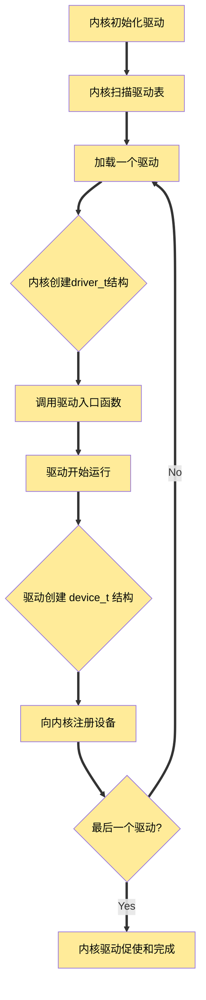

```mermaid

graph TD;
    A[内核初始化驱动]==>B[内核扫描驱动表];
    B==>C[加载一个驱动];
	C==>D{内核创建driver_t结构};
	D==>E[调用驱动入口函数];
	E==>F[驱动开始运行];
	F==>G{ 驱动创建 device_t 结构}
	G==>H[向内核注册设备];
	H==>I{最后一个驱动?};
	I==>|No|C
	I==>|Yes|J[内核驱动促使和完成]
    
	classDef default fill:#ffeb99,color:#000;
	
```